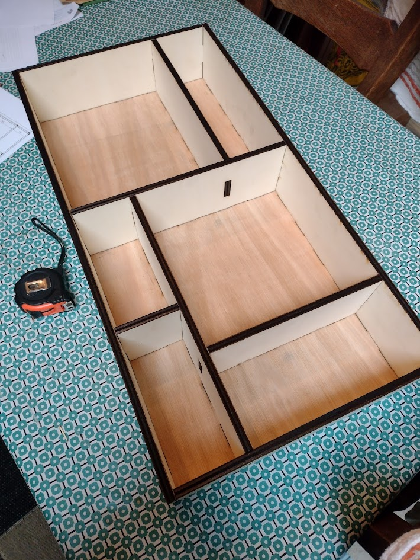

# FingerJoint-Cutter

FingerJoint-Cutter is a FreeCAD macro that carves interlocking finger joints between the solids inside a selected Part/App::Part container and then generates 2D projection layouts by sheet thickness for laser cutting.

- Processes only visible solids, keeps per-pair intersections disjoint, and applies kerf symmetrically.
- Clones the selected container so the originals stay untouched and hides the source container automatically.
- Packs projected faces into labeled layouts (e.g., `Layout_5mm_001`) grouped by detected material thicknesses.

## Requirements
- FreeCAD 1.0 (or newer).

## Installation
1. Open FreeCAD and go to `Macro → Macros…`.
2. Click `Create`, choose a name, and save.
3. Copy and paste the contents of the file `box.py` into the macro editor, then save.

## Usage

The macro is designed to be used with objects generated in the Part workshop of FreeCAD, ie: mostly things that look like planks. These planks can have holes, but the macro is NOT designed to process curved objects.

1. Store the planks that need to be processed in a Part container. Finger cuts will be generated in all places that overlap between two visible planks.
2. Select the container in the Model tree.
3. Go to `Macro → Macros…`. Select the macro as saved, and press Execute. You can also use a keyboard shortcut.
4. A dialog asks for:
   - Kerf (laser width) in mm. Default is 0.135 mm.
   - Minimum finger length in mm. Default is 30 mm.
5. The macro clones the container, hides the original, applies finger joints to the clones, and creates packed projection layouts beside the model. Layout objects are named `Layout_<thickness>mm_###`.
6. Select the layout object, go to "File - Export..." and export as DXF or SVG. The resulting file is ready to be sent to a laser cutter.

Tips:
- Ensure solids have valid shapes and nonzero thickness; invalid or hidden parts are skipped.
- After the macro finishes, you can export the generated layout objects to SVG/DXF from FreeCAD.

## Kerf, fingers, and layout ratios
- Kerf matters because the laser burns away material. The default 0.135 mm value is split evenly (kerf/2) on both sides of every internal cut so parts stay centered rather than oversized on one face. If joints feel loose, reduce kerf; if they are too tight, increase it.
- Finger length comes from the longest dimension of the overlap between two parts. The code prefers an odd finger count (alternating pattern) while keeping each finger at or above the requested minimum (30 mm by default). Cross-style intersections force exactly two fingers; other cases try the largest odd count that still meets the minimum, and fall back to three if none fit.
- Kerf trimming is applied to internal finger segments but not to the endpoints, preserving spacing along the joint.
- Each part is projected to 2D, grouped by detected thickness, and placed onto shelves. Layouts are named `Layout_<thickness>mm_###`.
- Packing uses a shelf algorithm with a heuristic sheet width of `sqrt(total_area * 1.5)`, leaving headroom for rotations. Every piece gets a 2 mm margin, and sheets are separated by 50 mm in the document for clarity.
