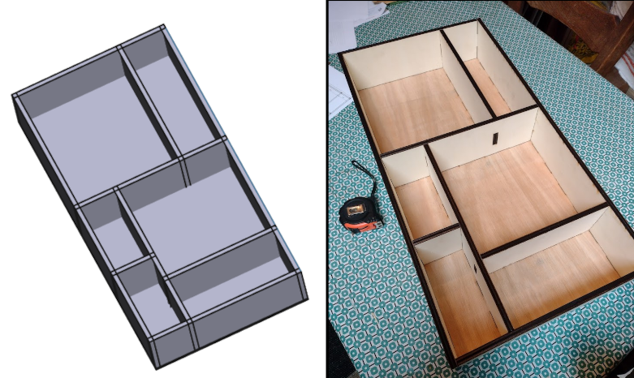
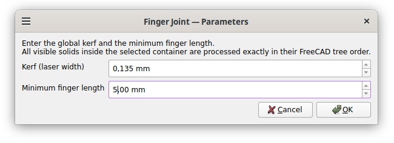
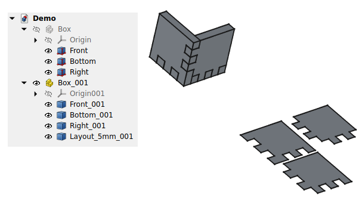

# FingerJoint-Cutter

FingerJoint-Cutter is a FreeCAD macro that carves interlocking finger joints between the solids inside a selected Part/App::Part container, then flattens and packs them into labeled layouts per detected material thickness for laser cutting.

  

## Requirements
- FreeCAD 1.0 or newer (with PySide2/6 available).

## Installation
1. Open FreeCAD and go to `Macro → Macros…`.
2. Click **Create**, choose a name, click **Ok**.
3. Copy the contents of [box.py](box.py?plain=1) into the macro editor and save.

## What it’s good for
- Straight, plank-like solids from the Part workbench. Planks may have holes.
- Orthogonal joints: finger generation is axis-aligned. Curved objects are not supported.
- Multi-thickness projects: each thickness gets its own packed layout.

## Workflow

### 1) Model your parts
- Create a new document, switch to the Part workbench, and add a Part container.
- Build each side as a solid that overlaps its neighbors where you want joints.
- Keep solids valid and give them nonzero thickness.

  

Tips:
- Hide any solid you do not want processed.
- Processing order follows the tree order in the Model view; reorder there for different joint patterns.

### 2) Run the macro
- Select the container.
- Open `Macro → Macros…`, pick this macro, and click **Execute** (or use a shortcut).

  

Parameters:
- **Kerf (laser width)** in mm — default 0.135 mm is split kerf/2 per side of every internal cut. If joints are loose, decrease kerf; if too tight, increase it.
- **Minimum finger length** in mm — the algorithm enforces at least three fingers per intersection; this value is a lower bound target.

Cross-type intersections always yield exactly two fingers (one per part) so the assembly can slide together.

### 3) Export layouts
The macro will:
- Clone the container (hiding the original).
- Compute finger cuts across all intersections.
- Generate 2D projections and pack them per thickness.

  

To export: select the generated layout object (e.g., `Layout_5mm_001`) and use `File → Export…` to your cutter’s format.

Tips:
- Packing aims for a 3:2 aspect ratio, common for laser beds.
- If multiple thicknesses exist, you get one layout per thickness.

## Notes and troubleshooting
- Only visible solids are processed; hidden parts are skipped.
- Shapes must be valid solids; zero-thickness or invalid shapes are ignored.
- Kerf is applied symmetrically to keep spacing consistent on both sides of each cut.
- If you see missing joints, check for non-intersecting parts or invalid geometry.

## Alternatives
- <a href=https://boxes.hackerspace-bamberg.de/>Boxes.py</a> is an Open Source box generator written in Python.
- <a href=https://github.com/execuc/LCInterlocking/blob/master/docs/interlocking.md>LCInterlocking</a> is a FreeCAD add-on to generate finger-cut boxes.

